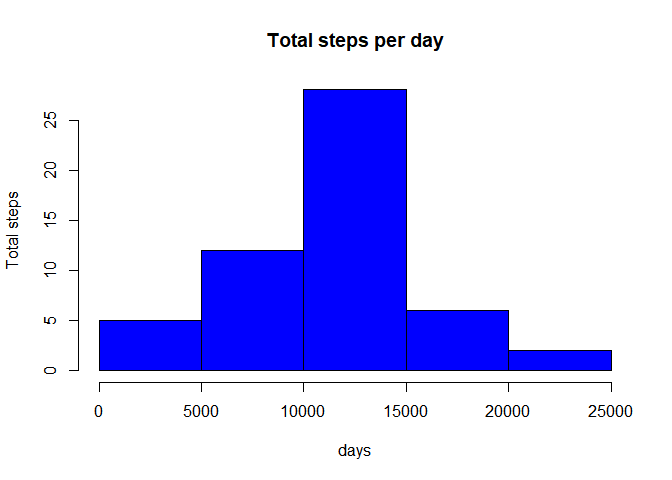
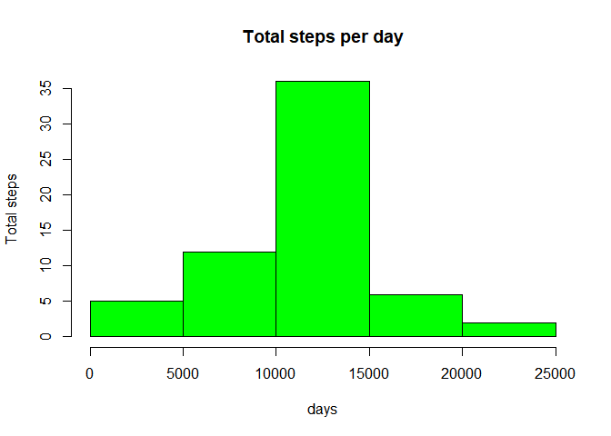
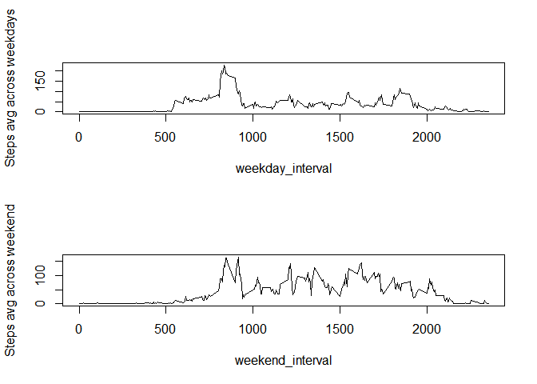

Assignment Description
----------------------

This is the reprot for the Week 2 assignment for the Reproducible Data
Research Course under the John Hopkins Data Science Specialisation at
Coursera.

It is now possible to collect a large amount of data about personal
movement using activity monitoring devices such as a Fitbit, Nike
Fuelband, or Jawbone Up. These type of devices are part of the
"quantified self" movement - a group of enthusiasts who take
measurements about themselves regularly to improve their health, to find
patterns in their behavior, or because they are tech geeks. But these
data remain under-utilized both because the raw data are hard to obtain
and there is a lack of statistical methods and software for processing
and interpreting the data.

This assignment makes use of data from a personal activity monitoring
device. This device collects data at 5 minute intervals through out the
day. The data consists of two months of data from an anonymous
individual collected during the months of October and November, 2012 and
include the number of steps taken in 5 minute intervals each day.

Loading & Pre Processing Data
-----------------------------

    activities<-read.csv("C:\\Users\\Apurv\\Desktop\\Data_Science\\activity.csv")
    str(activities)

    ## 'data.frame':    17568 obs. of  3 variables:
    ##  $ steps   : int  NA NA NA NA NA NA NA NA NA NA ...
    ##  $ date    : Factor w/ 61 levels "2012-10-01","2012-10-02",..: 1 1 1 1 1 1 1 1 1 1 ...
    ##  $ interval: int  0 5 10 15 20 25 30 35 40 45 ...

    library(dplyr)

    ## 
    ## Attaching package: 'dplyr'

    ## The following objects are masked from 'package:stats':
    ## 
    ##     filter, lag

    ## The following objects are masked from 'package:base':
    ## 
    ##     intersect, setdiff, setequal, union

    numberNA<-sum(is.na(activities$steps))
    frac_na<-numberNA/nrow(activities)
    activity<-filter(activities,!is.na(activities$steps))

In the above code, data was loaded & preprocessed to understand the
statistics of the various data features and isolate dataset with no
missing values.

Mean Number of Steps Per Day
----------------------------

    activity_aggr<-aggregate(activity$steps,by=list(dates=activity$date),FUN=sum)
    hist(activity_aggr$x,xlab="days",ylab="Total steps",col="blue",main="Total steps per day")

    summary(activity_aggr$x)

    ##    Min. 1st Qu.  Median    Mean 3rd Qu.    Max. 
    ##      41    8841   10765   10766   13294   21194

In the above code, the total number of steps per day was calculated &
plotted as a histogram. The mean & median of the dataset with no missing
values is 10766 & 10765 respectively.

Daily Activity Pattern
----------------------

    activity_aggr2<-aggregate(activity$steps,by=list(interv=activity$interval),FUN=mean)
    plot(activity_aggr2$x~activity_aggr2$interv,type="l",xlab="5 minute interval",ylab="Steps avg across days")

In the above code, the line plot is between the 5 minute intervals of a
day & the steps during that interval, averaged across all days. The time
interval 8:35-8:40 has the maximum number of steps, probably due to the
active morning routines of people.

Imputing Missing Values
-----------------------

    print("Total NA values ")

    ## [1] "Total NA values "

    numberNA

    ## [1] 2304

    activity_miss<-filter(activities,is.na(activities$steps))
    for (i in 1:nrow(activity_miss))
      activity_miss[i,]$steps<-activity_aggr2[activity_aggr2$interv==activity_miss[i,]$interval,]$x
    activity_imputed<-rbind(activity,activity_miss)
    activity_imputed<-activity_imputed[order(activity_imputed$date),]
    activity_aggr3<-aggregate(activity_imputed$steps,by=list(dates=activity_imputed$date),FUN=sum)
    hist(activity_aggr3$x,xlab="days",ylab="Total steps",col="green",main="Total steps per day")

    summary(activity_aggr3$x)

    ##    Min. 1st Qu.  Median    Mean 3rd Qu.    Max. 
    ##      41    9819   10766   10766   12811   21194

The strategy used for imputing is replacing the NA values with the
number of steps averaged over days, in that time interval of the day.
The Total number of missing values in the initial dataset is 2304. As
expected, the total number of steps per day increased as the imputed
values now replaced the missing values in each day. The mean & median of
this imputed dataset is 10766 and 10766 respectively. The mean did not
change because the imputed values were derived from the mean values of
the dataset with non missing values itself. The median increased by 1.

Difference between weekday & weekend
------------------------------------

    activity_imputed$daytype<-weekdays(as.Date(activity_imputed$date))
    weekday_act<-filter(activity_imputed,activity_imputed$daytype!="Saturday" & activity_imputed$daytype!="Sunday")
    weekd_aggr<-aggregate(weekday_act$steps,by=list(interv=weekday_act$interval),FUN=mean)
    weekend_act<-filter(activity_imputed,activity_imputed$daytype=="Saturday" | activity_imputed$daytype=="Sunday")
    weeke_aggr<-aggregate(weekend_act$steps,by=list(interv=weekend_act$interval),FUN=mean)
    par(mfrow=c(2,1))
    plot(weekd_aggr$x~weekd_aggr$interv,type="l",xlab="weekday_interval",ylab="Steps avg across weekdays")
    plot(weeke_aggr$x~weeke_aggr$interv,type="l",xlab="weekend_interval",ylab="Steps avg across weekend")

The plots of weekends indicate a much more active routine in comparison
to the weekdays for hours post 10 AM in the morning. This is an
indication of shopping or going out behaviour, often opted out during
the weekends in comparison to the popular desk jobs at work. The time
before 10 AM, the number of steps during the weekdays seem to be a
little higher atleast around the 8 hour mark. On weekdays, people
generally tend to wake up a little later as there is no work.
